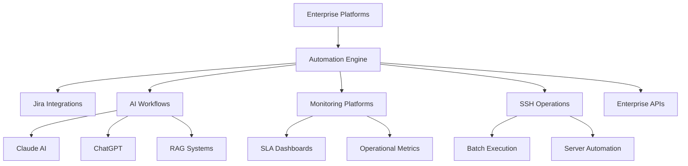

  

 

  <a href="README_ES.md">🇪🇸 Español</a>

# Juan Sebastián Yustre

### Automation & AI Operations Engineer

Building enterprise automation platforms, AI-powered workflows and operational tooling.

 

  

---

# 🚀 About Me

Engineer specialized in enterprise automation, AI-powered operational tooling and workflow orchestration.

Focused on designing scalable platforms integrating:
- Artificial Intelligence
- Enterprise APIs
- Monitoring systems
- Jira ecosystems
- AI agents & RAG
- Operational automation
- Batch orchestration
- Secure enterprise integrations

---

# 🧠 Enterprise Expertise

- Enterprise Automation
- AI Workflow Orchestration
- Operational Tooling
- Jira Administration
- SLA & KPI Platforms
- Monitoring & Observability
- AI Agents & RAG
- Enterprise APIs
- SSH Orchestration
- PCI Security Automation
- Batch Processing Platforms
- Workflow Architecture

---

# ⚡ Tech Stack

 

 

---

# 🏗️ Featured Projects

# Enterprise Process Automation Platform

Enterprise operational automation platform integrating Jira, SSH servers, workflows and AI-powered orchestration.

### Key Features

- Automated enterprise workflows
- SSH orchestration
- AI-assisted operational automation
- Monitoring & alerting
- Enterprise integrations
- Jira ecosystem automation

### Stack

Python • n8n • Jira • Linux • APIs • SSH

  

---

# Enterprise Batch Orchestrator

Operational platform for controlled batch execution with parallel workers and real-time monitoring.

### Key Features

- Multi-worker execution engine
- ANSI-aware parser
- Queue orchestration
- Real-time operational logs
- Fail-safe controls
- Operational summaries

### Stack

Python • Tkinter • Paramiko • Threading • SSH

  

---

# AI HR Operations Portal

Enterprise HR platform for operational workflows and AI-assisted employee management.

### Key Features

- HR operational workflows
- AI-assisted automation
- Authentication system
- SQL integrations
- Operational dashboards
- Automated processes

### Stack

Python • Flask • SQL • n8n • Claude • Docker

  

---

# AI Document Agent Platform

AI-powered document processing and semantic retrieval platform using RAG pipelines and contextual querying.

### Key Features

- RAG pipelines
- Semantic chunking
- AI retrieval
- Contextual search
- Multi-document ingestion
- Prompt orchestration

### Stack

Claude • Python • RAG • AI • Document Processing

  

---

# SLA & KPI Monitoring Platform

Operational dashboard platform for SLA tracking, KPI monitoring and executive reporting.

### Key Features

- SLA engine
- Executive dashboards
- Operational analytics
- Real-time metrics
- Automated reporting
- Jira integrations

### Stack

Flask • Docker • Python • Jira API • SQL

  

---

# Clinical System

Enterprise clinical management platform focused on secure architecture and operational workflows.

### Key Features

- Clinical workflows
- Secure operations
- API integrations
- Patient management
- Enterprise architecture
- Data management

### Stack

React • SQL • APIs • Enterprise Architecture

  

---

# HOMII Real Estate Platform

Digital real estate platform focused on automation, lead workflows and operational management.

### Key Features

- Property management
- Responsive UI
- Automation-ready architecture
- Lead workflows
- Digital onboarding
- Operational management

### Stack

Python • HTML • CSS • APIs • Codex

---

# Jira PCI Security Engine

Security automation platform for detecting PCI-sensitive information exposure inside Jira environments.

### Key Features

- PAN detection
- PCI compliance workflows
- Automated alerting
- Sensitive data masking
- Security integrations
- Automated deletion

### Stack

Jira • Regex • Automation • Security • PCI DSS

---

# AI Operations Assistant

AI-powered operational assistant integrated with Teams, Jira and enterprise workflows.

### Key Features

- Teams integrations
- AI classification
- Automated responses
- Workflow orchestration
- Operational alerting
- Enterprise integrations

### Stack

n8n • Microsoft Graph • Jira • Claude • APIs

  

---

# 📊 Operational Impact

- 80% reduction in manual operational tasks
- 6h → 1h optimization in batch execution processes
- Enterprise workflow automation across multiple platforms
- AI-assisted operational tooling implementation
- Real-time monitoring and SLA visibility
- Secure enterprise integrations and orchestration

---

# 🏛️ Architecture & Operations

---

# 📈 GitHub Analytics

---

# 🏆 Achievements

---

# 🎯 Current Focus

- Enterprise Automation
- AI Workflow Orchestration
- Monitoring Platforms
- Operational Tooling
- AI Integrations
- Enterprise APIs
- Workflow Architecture
- AI Agents & RAG

---

# 📫 Contact

### Location
Bogotá, Colombia

### Professional Profiles

- LinkedIn: https://www.linkedin.com/in/juanyustre/
- Email: sebastianyustre@gmail.com

---

### Building scalable automation and AI-powered operational platforms.

