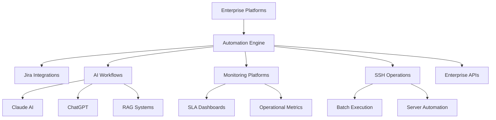
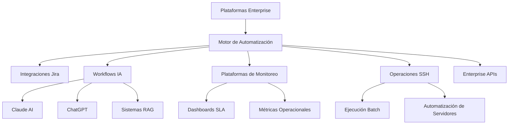

# Juan Sebastián Yustre (English)

### Automation & AI Operations Engineer

Building enterprise automation platforms, AI workflows and operational tooling.

 

---

# About Me

Engineer focused on enterprise automation, AI integrations, operational tooling and workflow orchestration.

Specialized in building scalable solutions for:
- Enterprise operations
- AI-powered workflows
- Monitoring platforms
- Process automation
- Secure integrations
- Operational dashboards
- Batch orchestration
- Jira ecosystem automation

---

# Tech Stack

## Automation & AI

---

# Featured Projects

## Enterprise Process Automation Platform

Enterprise operational automation platform integrating Jira, SSH servers, workflows and AI-powered orchestration.

### Features
- Automated enterprise workflows
- SSH orchestration
- Jira-integrated operations
- Monitoring and alerting
- AI-assisted automation
- Enterprise integrations

### Stack
Python • n8n • Jira • Linux • APIs • SSH

---

## Enterprise Batch Orchestrator

Operational platform for controlled execution of batch processes with real-time monitoring and parallel workers.

### Features
- Multi-worker execution engine
- Real-time logs
- ANSI-aware parser
- Queue orchestration
- Operational summaries
- Fail-safe controls

### Stack
Python • Tkinter • Paramiko • Threading • SSH

---

## AI HR Operations Portal

Enterprise HR platform for employee workflow management and AI-assisted operational processes.

### Features
- Employee novelty management
- AI-assisted workflows
- SQL integration
- Authentication system
- Operational dashboards
- Automated workflows

### Stack
Python • Flask • SQL • n8n • Claude • Docker

---

## AI Document Agent Platform

AI-powered document processing and contextual retrieval platform using semantic fragmentation and intelligent querying.

### Features
- RAG pipelines
- Semantic chunking
- AI retrieval
- Contextual search
- Multi-document ingestion
- Prompt orchestration

### Stack
Claude • Python • RAG • AI • Document Processing

---

## SLA & KPI Monitoring Platform

Operational dashboard platform for SLA tracking, KPI monitoring and enterprise reporting.

### Features
- SLA engine
- Jira integration
- Executive dashboards
- Operational analytics
- Real-time metrics
- Automated reporting

### Stack
Flask • Docker • Python • Jira API • SQL

---

## Prisma Clinical System

Enterprise clinical management platform with secure architecture and operational workflows.

### Features
- Clinical workflows
- Secure operations
- API integrations
- Patient management
- Enterprise architecture
- Data management

### Stack
React • SQL • APIs • Enterprise Architecture

---

## HOMII Real Estate Platform

Digital real estate platform focused on automation, property management and operational workflows.

### Features
- Property management
- Responsive UI
- Automation-ready architecture
- Lead workflows
- Digital onboarding
- Operational management

### Stack
Python • HTML • CSS • APIs • Codex

---

## Jira PCI Security Engine

Security automation platform for detecting sensitive PCI data exposure in Jira environments.

### Features
- PAN detection
- PCI compliance workflows
- Automated alerts
- Sensitive data masking
- Automated deletion
- Security integrations

### Stack
Jira • Regex • Automation • Security • PCI DSS

---

## AI Operations Assistant

AI-powered operational assistant integrated with Teams, Jira and enterprise workflows.

### Features
- Teams integration
- AI classification
- Automated responses
- Operational alerting
- Workflow orchestration
- Enterprise integrations

### Stack
n8n • Microsoft Graph • Jira • Claude • APIs

---

# Professional Impact

- Reduced operational execution from 6h to 1h through automation
- Built enterprise operational tooling and orchestration systems
- Implemented AI-assisted operational workflows
- Integrated Jira, Teams and enterprise APIs
- Developed monitoring and SLA platforms
- Automated critical operational processes
- Designed enterprise-grade workflow architectures

---

# Architecture & Operations

# Current Focus

- Enterprise Automation
- AI Workflow Orchestration
- Operational Tooling
- Monitoring Platforms
- AI Integrations
- Jira Ecosystem Automation
- Enterprise Architecture
- RAG & AI Agents

---

# Contact

### Location
Bogotá, Colombia

### Professional Profiles
- LinkedIn: https://www.linkedin.com/in/juanyustre/
- Email: sebastianyustre@gmail.com

---

# Juan Sebastián Yustre Español

### Automation & AI Operations Engineer

Construyendo plataformas de automatización empresarial, flujos de IA y herramientas operacionales.

 

---

# Sobre Mí

Ingeniero enfocado en automatización empresarial, integraciones con IA, herramientas operacionales y orquestación de workflows.

Especializado en el diseño e implementación de soluciones escalables para:

- Automatización de procesos empresariales
- Integraciones con inteligencia artificial
- Plataformas de monitoreo y observabilidad
- Automatización operacional
- Integraciones seguras entre plataformas
- Dashboards ejecutivos y SLA
- Orquestación de procesos batch
- Automatizaciones dentro del ecosistema Jira
- Arquitecturas orientadas a operaciones

---

# Stack Tecnológico

## Automatización & IA

---

# Proyectos Destacados

## Enterprise Process Automation Platform

Plataforma empresarial de automatización operacional integrada con Jira, servidores SSH, workflows y orquestación impulsada por IA.

### Características

- Automatización de procesos empresariales
- Orquestación mediante SSH
- Integraciones operacionales con Jira
- Monitoreo y alertamiento
- Automatización asistida con IA
- Integraciones enterprise

### Stack

Python • n8n • Jira • Linux • APIs • SSH

---

## Enterprise Batch Orchestrator

Plataforma operacional para ejecución controlada de procesos batch con monitoreo en tiempo real y workers paralelos.

### Características

- Motor de ejecución multi-worker
- Logs en tiempo real
- Parser ANSI-aware
- Orquestación de colas
- Resúmenes operacionales
- Controles fail-safe

### Stack

Python • Tkinter • Paramiko • Threading • SSH

---

## AI HR Operations Portal

Portal corporativo para gestión de novedades de RRHH y automatización operacional asistida por IA.

### Características

- Gestión de novedades
- Workflows asistidos con IA
- Integración SQL
- Sistema de autenticación
- Dashboards operacionales
- Automatización de procesos

### Stack

Python • Flask • SQL • n8n • Claude • Docker

---

## AI Document Agent Platform

Plataforma de agentes inteligentes para procesamiento documental, fragmentación semántica y consultas contextuales.

### Características

- Pipelines RAG
- Fragmentación semántica
- Recuperación contextual
- Búsqueda inteligente
- Ingesta multi-documento
- Orquestación de prompts

### Stack

Claude • Python • RAG • IA • Procesamiento Documental

---

## SLA & KPI Monitoring Platform

Plataforma operacional para monitoreo de SLA, KPIs y reporting ejecutivo.

### Características

- Motor SLA
- Integración Jira
- Dashboards ejecutivos
- Analítica operacional
- Métricas en tiempo real
- Reportes automáticos

### Stack

Flask • Docker • Python • Jira API • SQL

---

## Prisma Clinical System

Sistema clínico empresarial orientado a operaciones médicas y arquitectura segura.

### Características

- Workflows clínicos
- Operaciones seguras
- Integraciones API
- Gestión de pacientes
- Arquitectura enterprise
- Administración de datos

### Stack

React • SQL • APIs • Arquitectura Empresarial

---

## HOMII Real Estate Platform

Plataforma inmobiliaria digital enfocada en automatización, captación y gestión operacional.

### Características

- Gestión de inmuebles
- Interfaz responsive
- Arquitectura preparada para automatización
- Workflows comerciales
- Onboarding digital
- Gestión operacional

### Stack

Python • HTML • CSS • APIs • Codex

---

## Jira PCI Security Engine

Motor de seguridad para detección automática de exposición de datos sensibles PCI en Jira.

### Características

- Detección de PAN
- Flujos PCI DSS
- Alertamiento automático
- Enmascaramiento de datos sensibles
- Eliminación automática
- Integraciones de seguridad

### Stack

Jira • Regex • Automatización • Seguridad • PCI DSS

---

## AI Operations Assistant

Asistente operacional impulsado por IA integrado con Teams, Jira y workflows empresariales.

### Características

- Integración con Teams
- Clasificación mediante IA
- Respuestas automáticas
- Alertamiento operacional
- Orquestación de workflows
- Integraciones enterprise

### Stack

n8n • Microsoft Graph • Jira • Claude • APIs

---

# Impacto Profesional

- Reducción de ejecuciones operacionales de 6h a 1h mediante automatización
- Desarrollo de plataformas y herramientas operacionales enterprise
- Implementación de workflows asistidos con IA
- Integración de Jira, Teams y APIs empresariales
- Construcción de plataformas de monitoreo y SLA
- Automatización de procesos críticos
- Diseño de arquitecturas orientadas a automatización y operaciones

---

# Arquitectura & Operaciones

---

# Enfoque Actual

- Automatización Empresarial
- Orquestación de Workflows IA
- Herramientas Operacionales
- Plataformas de Monitoreo
- Integraciones con IA
- Automatizaciones Jira
- Arquitectura Enterprise
- Agentes IA & RAG

---

# Contacto

### Ubicación
Bogotá, Colombia

### Perfiles Profesionales

- LinkedIn: https://www.linkedin.com/in/juanyustre/
- Email: sebastianyustre@gmail.com

---

### Construyendo plataformas escalables de automatización e inteligencia artificial.

### Building scalable automation and AI-powered operational platforms.

