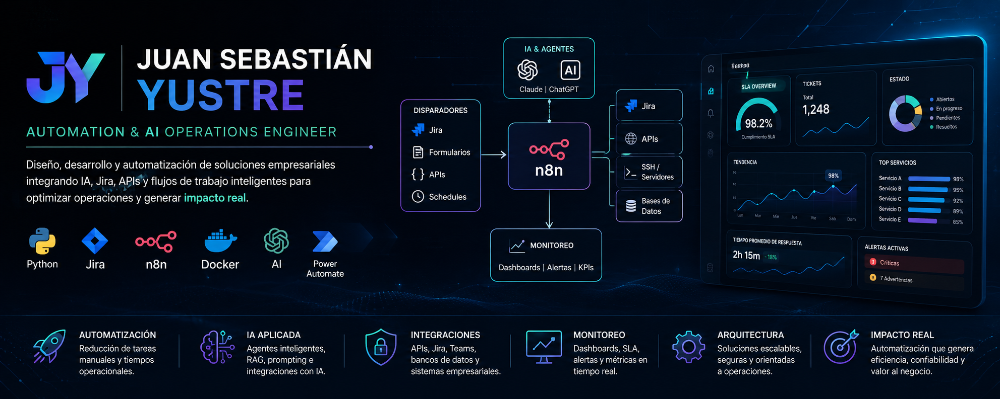
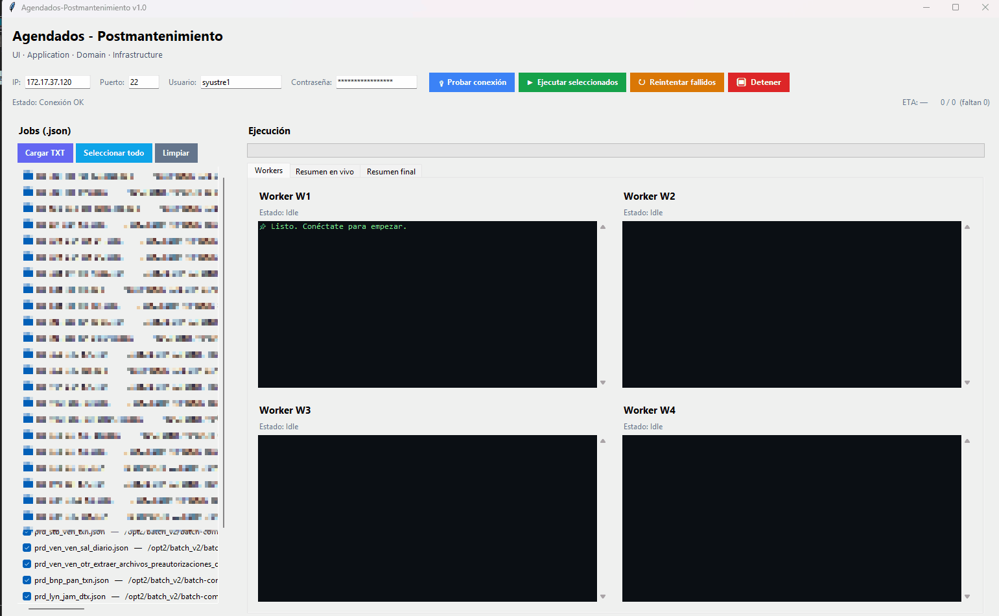
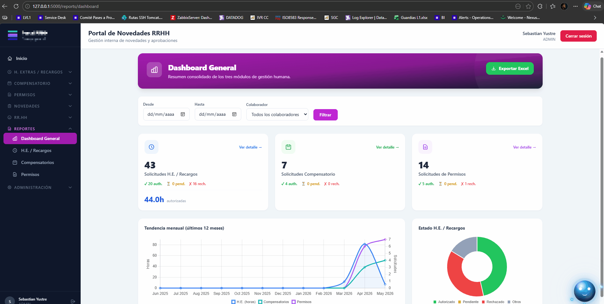
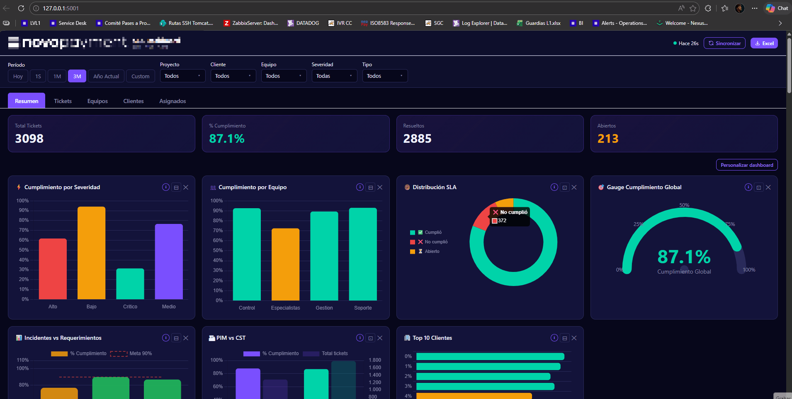
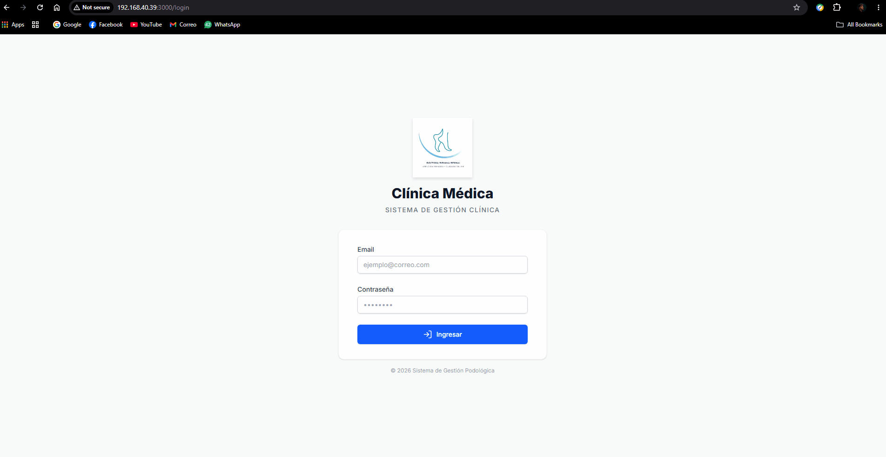
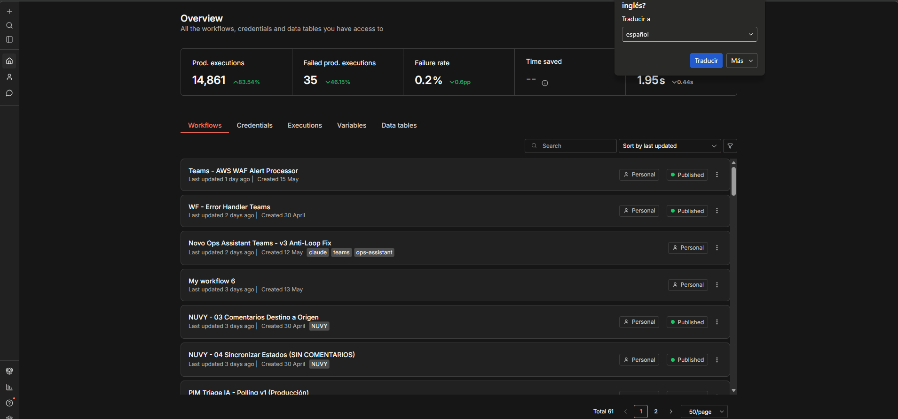
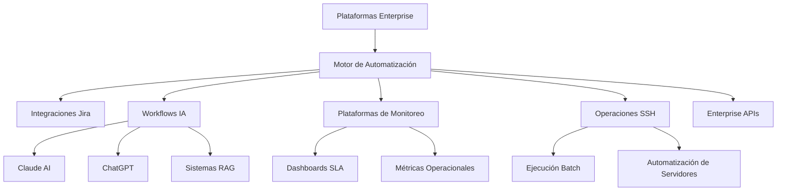

  

 

  <a href="README.md">🇺🇸 English</a>

# Juan Sebastián Yustre

### Automation & AI Operations Engineer

Construyendo plataformas de automatización empresarial, flujos impulsados por IA y herramientas operacionales.

 

  

---

# 🚀 Sobre Mí

Ingeniero especializado en automatización empresarial, herramientas operacionales impulsadas por IA y orquestación de workflows.

Enfocado en diseñar plataformas escalables integrando:

- Inteligencia Artificial
- Enterprise APIs
- Sistemas de monitoreo
- Ecosistema Jira
- Agentes IA & RAG
- Automatización operacional
- Orquestación batch
- Integraciones empresariales seguras

---

# 🧠 Especialidades Enterprise

- Automatización Empresarial
- Orquestación de Workflows IA
- Herramientas Operacionales
- Administración Jira
- Plataformas SLA & KPI
- Monitoreo & Observabilidad
- Agentes IA & RAG
- Enterprise APIs
- Orquestación SSH
- Automatización PCI Security
- Plataformas Batch
- Arquitectura de Workflows

---

# ⚡ Stack Tecnológico

 

 

---

# 🏗️ Proyectos Destacados

# Enterprise Process Automation Platform

Plataforma empresarial de automatización operacional integrada con Jira, servidores SSH, workflows y orquestación impulsada por IA.

### Características Principales

- Automatización de workflows empresariales
- Orquestación mediante SSH
- Automatización operacional asistida con IA
- Monitoreo y alertamiento
- Integraciones enterprise
- Automatización del ecosistema Jira

### Stack

Python • n8n • Jira • Linux • APIs • SSH

  

---

# Enterprise Batch Orchestrator

Plataforma operacional para ejecución controlada de procesos batch con workers paralelos y monitoreo en tiempo real.

### Características Principales

- Motor multi-worker
- Parser ANSI-aware
- Orquestación de colas
- Logs operacionales en tiempo real
- Controles fail-safe
- Resúmenes operacionales

### Stack

Python • Tkinter • Paramiko • Threading • SSH

---

# AI HR Operations Portal

Portal empresarial de RRHH enfocado en workflows operacionales y automatización asistida por IA.

### Características Principales

- Workflows operacionales RRHH
- Automatización asistida con IA
- Sistema de autenticación
- Integraciones SQL
- Dashboards operacionales
- Procesos automatizados

### Stack

Python • Flask • SQL • n8n • Claude • Docker

  

---

# AI Document Agent Platform

Plataforma inteligente de procesamiento documental y recuperación semántica utilizando pipelines RAG y consultas contextuales.

### Características Principales

- Pipelines RAG
- Fragmentación semántica
- Recuperación mediante IA
- Búsqueda contextual
- Ingesta multi-documento
- Orquestación de prompts

### Stack

Claude • Python • RAG • IA • Procesamiento Documental

  

---

# SLA & KPI Monitoring Platform

Plataforma operacional para monitoreo de SLA, KPIs y reporting ejecutivo.

### Características Principales

- Motor SLA
- Dashboards ejecutivos
- Analítica operacional
- Métricas en tiempo real
- Reportes automáticos
- Integraciones Jira

### Stack

Flask • Docker • Python • Jira API • SQL

  

---

# Clinical System

Sistema clínico empresarial enfocado en arquitectura segura y workflows operacionales.

### Características Principales

- Workflows clínicos
- Operaciones seguras
- Integraciones API
- Gestión de pacientes
- Arquitectura enterprise
- Administración de datos

### Stack

React • SQL • APIs • Arquitectura Empresarial

  

---

# HOMII Real Estate Platform

Plataforma inmobiliaria digital enfocada en automatización, workflows comerciales y gestión operacional.

### Características Principales

- Gestión de inmuebles
- Interfaz responsive
- Arquitectura preparada para automatización
- Workflows comerciales
- Onboarding digital
- Gestión operacional

### Stack

Python • HTML • CSS • APIs • Codex

---

# Jira PCI Security Engine

Plataforma de automatización de seguridad para detección de exposición de información PCI dentro de entornos Jira.

### Características Principales

- Detección PAN
- Workflows PCI Compliance
- Alertamiento automático
- Enmascaramiento de información sensible
- Integraciones de seguridad
- Eliminación automática

### Stack

Jira • Regex • Automatización • Seguridad • PCI DSS

---

# AI Operations Assistant

Asistente operacional impulsado por IA integrado con Teams, Jira y workflows empresariales.

### Características Principales

- Integraciones con Teams
- Clasificación mediante IA
- Respuestas automáticas
- Orquestación de workflows
- Alertamiento operacional
- Integraciones enterprise

### Stack

n8n • Microsoft Graph • Jira • Claude • APIs

  

---

# 📊 Impacto Operacional

- 80% de reducción en tareas operacionales manuales
- Optimización de procesos batch de 6h → 1h
- Automatización enterprise sobre múltiples plataformas
- Implementación de herramientas operacionales asistidas con IA
- Visibilidad SLA y monitoreo en tiempo real
- Integraciones y orquestación enterprise seguras

---

# 🏛️ Arquitectura & Operaciones

# 🏆 Achievements

---

# 🎯 Enfoque Actual

- Automatización Empresarial
- Orquestación de Workflows IA
- Plataformas de Monitoreo
- Herramientas Operacionales
- Integraciones con IA
- Enterprise APIs
- Arquitectura de Workflows
- Agentes IA & RAG

---

# 📫 Contacto

### Ubicación
Bogotá, Colombia

### Perfiles Profesionales

- LinkedIn: https://www.linkedin.com/in/juanyustre/
- Email: sebastianyustre@gmail.com

---

### Construyendo plataformas escalables de automatización e inteligencia artificial.

